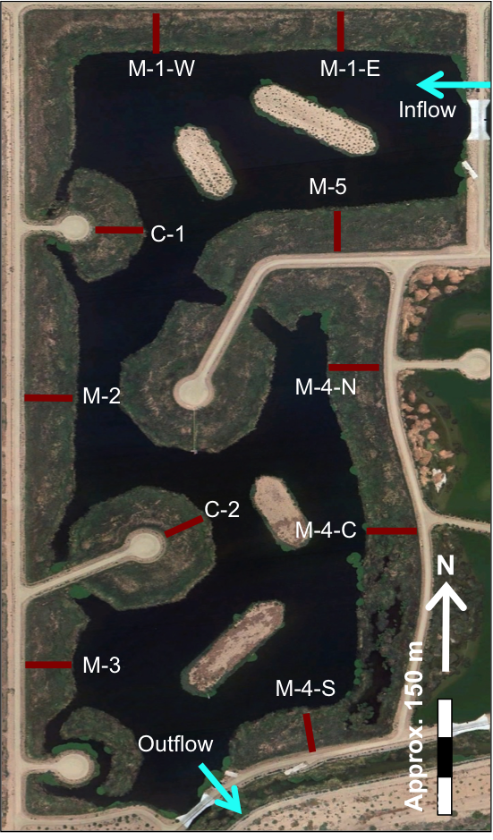
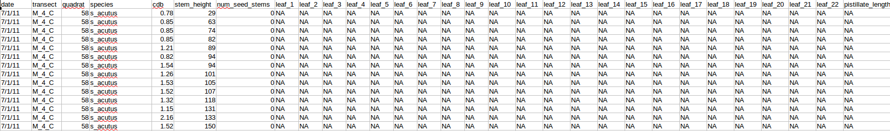
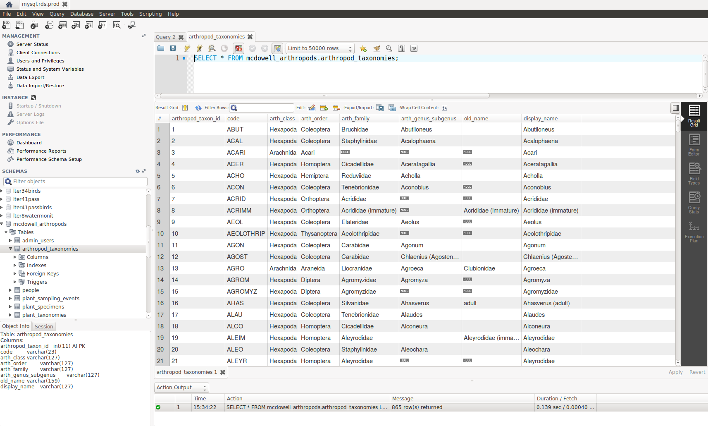
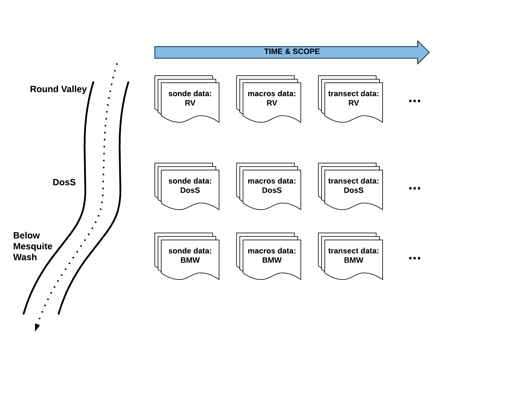

```{r setup, include=FALSE}
options(htmltools.dir.version = FALSE)
```

#### introduction to databases

1. a practical introduction to databases
1. demystify databases
1. data structure 

---

#### terminology

- database (DB) is an organized collection of data
- database management system (DBMS) is a software that allows interacting with the database (e.g., storing, retrieving, updating data)

.footnote[Introduction to Data Science: BIO 260 and CSCI E107, Harvard T.H. Chan School of Public Health]

---

#### relational database

- many types and flavors of databases: document, key-value
- relational model (RM):
  + built on relational algebra, a combination of:
      - selections ( WHERE ... )
      - projections ( SELECT ... )
      - Cartesian products ( JOIN ... )
      - and more
- RDBMS = DBMS + RM
- SQL (Structured Query Language): language designed to interact with RDBMS

.footnote[Introduction to Data Science: BIO 260 and CSCI E107, Harvard T.H. Chan School of Public Health]


---

#### RDBMS software solutions

- commercial
  + Oracle
  + Microsoft SQL Server
  + ...
- open-source
  + MySQL
  + PostgreSQL
  + SQLite
  + ...
  
.footnote[Introduction to Data Science: BIO 260 and CSCI E107, Harvard T.H. Chan School of Public Health]

---

#### SQLite
  
- SQLite is the easiest way to start: unlike most others, it is not a client-server DB. The whole DB can live in a (portable) folder. All the required tools are included in dplyr.
- light but still powerful. It barely requires configuration but can still store and process large amounts of data. It is used in most web browsers and mail clients.

.footnote[Introduction to Data Science: BIO 260 and CSCI E107, Harvard T.H. Chan School of Public Health]

---

#### database table structure

<br>
.center[
  
]

.footnote[Introduction to Data Science: BIO 260 and CSCI E107, Harvard T.H. Chan School of Public Health]

---

#### database structure (schema)

.center[
  
]

.footnote[Hand-crafted relational databases for fun and science, Naupaka Zimmerman, Data Carpentry, 2016-12-05]

---

#### why use a RDBMS?

- data size, typically when the data fits on drive but not in memory
- one DB vs (too) many CSV files - **complexity!**
- harness the power of SQL
- data already live in a DB
- DB provides extra tools, for example a GIS toolbox to deal with spatial data


.footnote[Introduction to Data Science: BIO 260 and CSCI E107, Harvard T.H. Chan School of Public Health]

---

#### Tres Rios Wetlands

.center[
  
]

---

#### Tres Rios raw data

<small>primary production</small>


<hr>
<small>transpiration</small>


<hr>
<small>water quality</small>


---

#### Tres Rios database schema

.center[
  
]

---

#### Tres Rios database schema: water quality

.center[
  
]

---

#### McDowell Sonoran Preserve arthropod taxonomy

.center[
  
]

---

#### Sycamore Creek

.center[
  
]

---

#### sample sonde data

.center[
  
]

---

#### Sycamore Creek: sonde data

.center[
  
]

---

#### Sycamore Creek: many variables

.center[
  
]