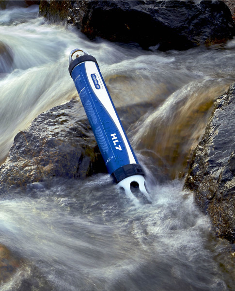

```{r setup, include=FALSE}
options(htmltools.dir.version = FALSE)
```

#### objectives

* a practical introduction to databases

* demystify databases

* focus on data structure 

---

#### terminology: what is a database?

- database (DB) is an organized collection of data

- database management system (DBMS) is software that allows interacting with the database (e.g., storing, retrieving, updating data)

.footnote[[BST 260: Introduction to Data Science](https://datasciencelabs.github.io/)]

---

#### terminology: relational database

- many types and flavors of databases: document, key-value

- relational (from relational algebra)

- RDBMS = R + DBMS

.footnote[[BST 260: Introduction to Data Science](https://datasciencelabs.github.io/)]

---

#### terminology: the language of databases

- SQL (Structured Query Language): language designed to interact with RDBMS

.center[
  
]

.footnote[http://razorsql.com]

---

#### RDBMS software solutions

- commercial
  + Oracle
  + Microsoft SQL Server
  + ...
- open-source
  + MySQL
  + PostgreSQL
  + SQLite
  + ...
  
.footnote[[BST 260: Introduction to Data Science](https://datasciencelabs.github.io/)]

---

#### SQLite
  
- file-based, not client-server DB - the whole DB can live in a folder

- requires little configuration

- light but still powerful - can store and process large amounts of data

- used in most web browsers and mail clients

- consistent with database functionality across platforms

.footnote[[BST 260: Introduction to Data Science](https://datasciencelabs.github.io/)]

---

#### database table structure

<br>

.center[
  
]

.footnote[[BST 260: Introduction to Data Science](https://datasciencelabs.github.io/)]


---

#### database table structure: keys

<br>

.center[
  
]

.footnote[[Foreign Keys - Intro to Relational Databases (Udacity)](https://www.youtube.com/watch?reload=9&v=fnbLMcd0FGQ)]


---

#### McDowell Sonoran Preserve arthropod taxonomy

.center[
  
]


---

#### database structure (schema)

.center[
  
]

.footnote[Hand-crafted relational databases for fun and science, Naupaka Zimmerman, Data Carpentry, 2016-12-05]


---

#### why use a RDBMS?

- data size, typically when the data fits on drive but not in memory

- one DB vs (too) many CSV files - **complexity!**

- harness the power of SQL

- data already live in a DB

- DB provides extra tools, for example a GIS toolbox to deal with spatial data


.footnote[Introduction to Data Science: BIO 260 and CSCI E107, Harvard T.H. Chan School of Public Health]


---

#### Sycamore Creek

.center[
  
]


---

#### Sycamore Creek

.center[
  
]


---

#### sample sonde data

.less-left[
  
]

.more-right[
  
]


---

#### Sycamore Creek

.center[
  
]


---

#### Sycamore Creek

.center[
  
]


---

#### Sycamore Creek

.center[
  
]


---

#### Tres Rios Wetlands

.center[
  
]


---

#### Tres Rios raw data

<small>primary production</small>


<hr>
<small>transpiration</small>


<hr>
<small>water quality</small>


---

#### Tres Rios database schema

.center[
  
]

---

#### Tres Rios database schema: water quality

.center[
  
]

